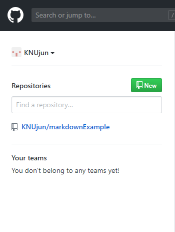
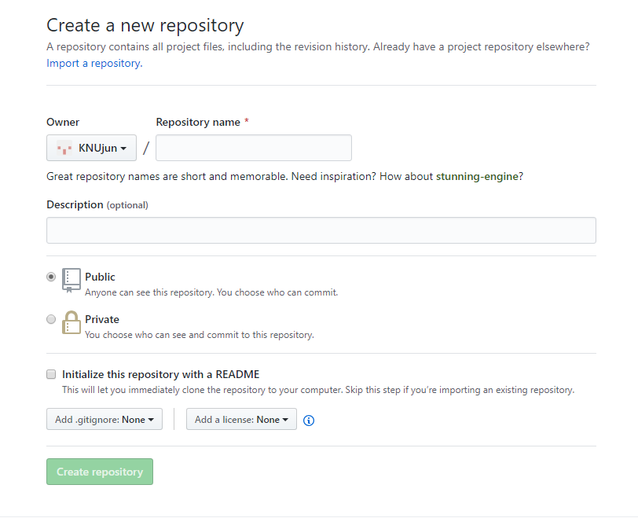
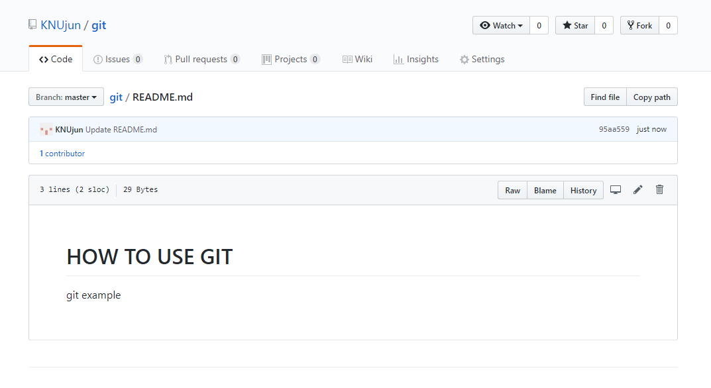

# 외부저장소 생성

이제 git을 본격적으로 사용하기에 앞서  
우선 [외부 저장소(remot repository)](https://git-scm.com/book/ko/v1/Git%EC%9D%98-%EA%B8%B0%EC%B4%88-%EB%A6%AC%EB%AA%A8%ED%8A%B8-%EC%A0%80%EC%9E%A5%EC%86%8C)를 만들어야합니다.
>**외부저장소**는 인터넷이나 네트워크 어딘가에 있는 저장소를 말합니다.

github에 접속 후 좌측 화면에 보면  
초록색으로 `NEW` 라고 적혀있는 박스가 있있습니다.
클릭해 줍니다.

다음 화면에서 _Repository name_과 _Description_을 작성하고  
_Initialize this repository with a README_ 를 체크한 뒤 `Creat repository`를 클릭합니다.

Repository name을 **git** 으로, Description을 **git example**로 작성했을 때, 다음과 같은 **외부저장소**가 만들어집니다.

---
## 다음 챕터
#### [Setting](setting.md)