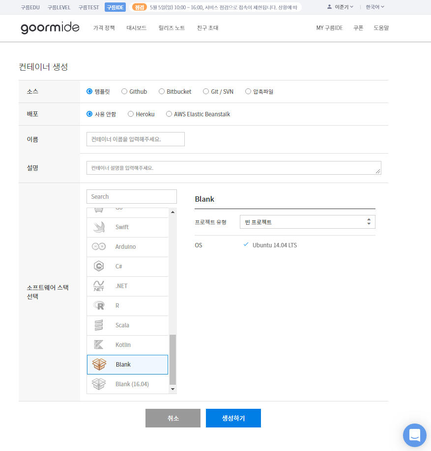
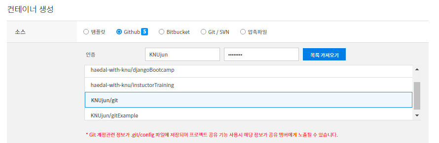
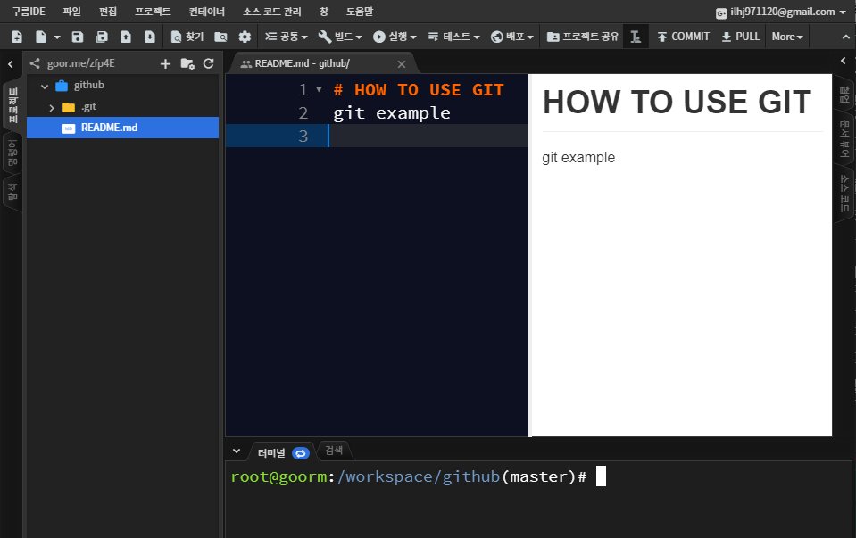

# Setting

git을 사용하기 전에 먼저 [**구름IDE**](https://ide.goorm.io/) 대시보드에 들어가서 새 컨테이너를 생성해 줍니다



**소스**를 Github로 고르고 Github의 `Username`과 `Password`를 입력합니다.  
>**구름IDE**를 통해 자동으로 Github 계정과 연동해줍니다.  

성공적으로 Github계정과 연동되었다면 아래에 자기 계정의 repository가 리스트 됩니다.  
그 중 이전 챕터에서 만든 repository를 고릅니다.




_컨테이너 이름_ 과 _설명_ 을 작성한뒤 소프트웨어 스택 선택 중 `Blank`를 고르고 생성하기를 누릅니다.

`Blank`로 컨테이너를 만들 시 터미널의 위치가 다음과 같이 되어 있습니다.  

```
root@goorm:~#
```

저희가 만든 작업공간으로 터미널을 옮겨 줍니다.  
workspace 뒤의 디렉토리는 자신이 만든 컨테이너의 이름이 됩니다.  

```
root@goorm:~# cd /workspace/github
root@goorm:/workspace/github(master)#
```

`(master)`의 의미는 나중에 설명해드리겠습니다.  

`README.md` 파일을 더블블릭해서 열어봅니다.  


이제 구름IDE를 통해 git을 사용할 준비를 모두 마쳤습니다.

---
## 다음 챕터
#### [Add & Commit](addCommit.md)


